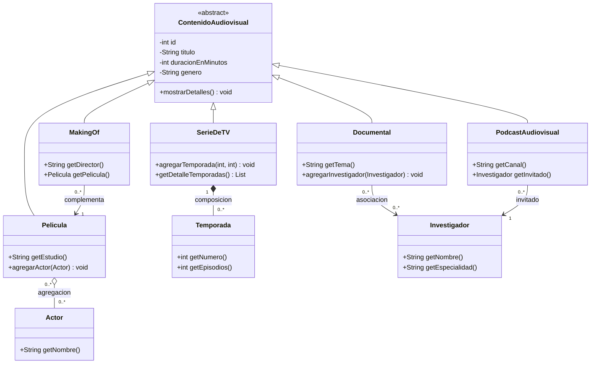

# Diagrama de clases UML

```mermaid
classDiagram
    class ContenidoAudiovisual {
        <<abstract>>
        -int id
        -String titulo
        -int duracionEnMinutos
        -String genero
        +mostrarDetalles() void
    }
    class Pelicula { +String getEstudio()
+agregarActor(Actor) void }
    class SerieDeTV { +agregarTemporada(int, int) void
+getDetalleTemporadas() List }
    class Documental { +String getTema()
+agregarInvestigador(Investigador) void }
    class Actor { +String getNombre() }
    class Temporada { +int getNumero()
+int getEpisodios() }
    class Investigador { +String getNombre()
+String getEspecialidad() }
    class PodcastAudiovisual { +String getCanal()
+Investigador getInvitado() }
    class MakingOf { +String getDirector()
+Pelicula getPelicula() }
    ContenidoAudiovisual <|-- Pelicula
    ContenidoAudiovisual <|-- SerieDeTV
    ContenidoAudiovisual <|-- Documental
    ContenidoAudiovisual <|-- PodcastAudiovisual
    ContenidoAudiovisual <|-- MakingOf
    Pelicula "0..*" o-- "0..*" Actor : agregacion
    SerieDeTV "1" *-- "0..*" Temporada : composicion
    Documental "0..*" --> "0..*" Investigador : asociacion
    PodcastAudiovisual "0..*" --> "1" Investigador : invitado
    MakingOf "0..*" --> "1" Pelicula : complementa
```

La agregación permite compartir actores. Las temporadas solo se crean mediante su serie. Las asociaciones vinculan objetos que pueden existir por separado.
